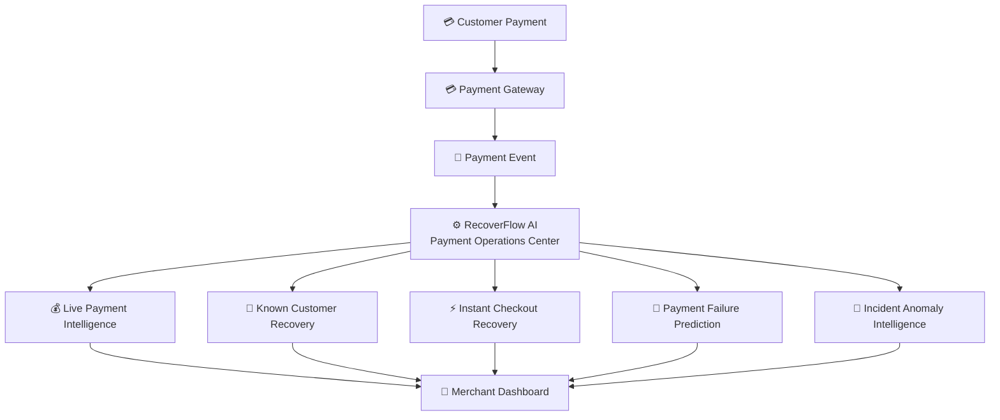
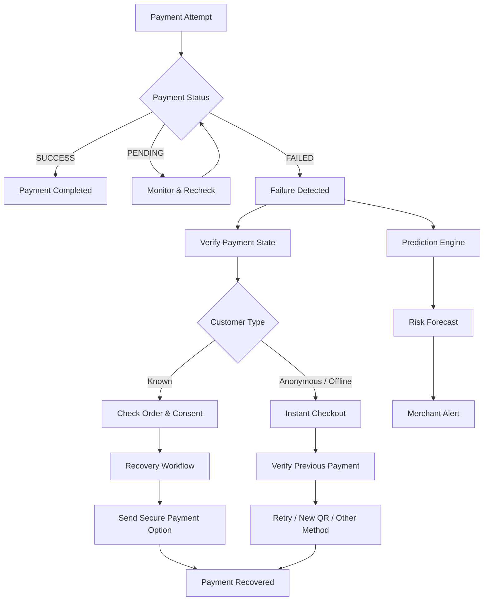

# RecoverFlow AI

> **"Intelligent Payment Recovery & Failure Prediction for Merchants"**

RecoverFlow AI is a production-quality, full-stack fintech platform designed to monitor live payment streams, verify payment states, orchestrate multi-channel recovery workflows, limit customer communication attempts, provide instant checkout recovery for anonymous in-person payments, and forecast payment failure risk.

---

## 1. Problem & Solution

### Problem
When a payment fails at checkout, merchants often face **uncompleted purchase opportunities**. Traditional systems either ignore failed payments completely or spam customers aggressively across third-party apps without verifying payment status, causing customer annoyance or accidental double-charging.

### Solution
RecoverFlow AI provides a real-time **AI Payment Operations Center** for merchants:
1. **Live Payment Intelligence**: Real-time earnings ticker, transaction logs, and payment gateway health metrics.
2. **Mode 1 Known Customer Recovery**: Multi-channel automated recovery (WhatsApp, SMS, Email) with consent verification and strict 2–3 attempt limits.
3. **Mode 2 Instant Checkout Recovery**: POS/QR merchant interface for anonymous customers with an instant payment state verification engine to prevent double charging.
4. **Payment Failure Prediction**: 24-hour risk forecasting and festival traffic multiplier analysis with actionable AI preparation checklists.
5. **Incident Anomaly Intelligence**: Detects unusual failure spikes (e.g. UPI failure rate jumping from 4% to 13.8%) with explainable root-cause labeling.

---
## 2. Architecture & Event Flow

RecoverFlow AI follows a simple event-driven architecture that connects payment events, real-time monitoring, recovery, and failure prediction.

### 🔷 System Architecture




### 🔷 Payment Recovery Flow




### Architecture Highlights

- **Payment Events** → Capture and process payment status changes.
- **Real-Time Dashboard** → Shows live payments, failures, and gateway health.
- **Recovery Engine** → Handles known-customer and anonymous/offline recovery.
- **Prediction Engine** → Forecasts potential payment failure risk.
- **Merchant Dashboard** → Provides actionable recovery and risk insights.

---

## 3. Technology Stack

- **Frontend**: Next.js 15 (App Router), React 19, TypeScript, Tailwind CSS, Framer Motion, Recharts, Lucide Icons.
- **Backend API**: Next.js Server Routes, Zod Validation, Custom In-Memory Event Hub.
- **Database & ORM**: Prisma ORM with SQLite (`prisma/dev.db`) out-of-the-box, zero external dependencies required.
- **Real-Time Streaming**: Server-Sent Events (SSE) at `/api/events`.

---

## 4. Key Navigation & Product Features

| Route | Feature | Description |
|---|---|---|
| `/` | **Overview Dashboard** | Real-time live earnings counter (₹4,82,450+), revenue area chart, **Quick Recovery Link & QR Generator**, gateway health badges, **AI Pulse** (NOW, NEXT, ACTION). |
| `/live-payments` | **Live Payments Stream** | Real-time transaction stream with animated incoming rows, status badges, and multi-field filters. |
| `/recovery` | **Recovery Command Center** | Queue of eligible uncompleted purchase opportunities with recovery scores, attempt counters, manual triggers, and **Interactive Customer Mobile Preview**. |
| `/recovery-automation` | **Automation Policy** | Configurable attempt limits (2 or 3 attempts), quiet hours policy (e.g. 22:00 to 08:00), and anti-spam guardrails. |
| `/instant-checkout` | **Instant Checkout Recovery** | Mode 2 POS/QR terminal view with payment state verification to prevent double payments. |
| `/predictions` | **Risk Forecast** | 24-hour risk forecasting & festival sale traffic multiplier simulator with AI recommendations. |
| `/radar` | **Recovery Radar** | Visually animated 6-stage funnel pipeline tracking payment recovery retention. |
| `/analytics` | **Analytics & ROI Optimizer** | Breakdown by channel (WhatsApp vs SMS vs Email), **Channel Messaging Cost ROI Optimizer**, **One-Click CSV Report Exporter**, payment method health, and failure reason distributions. |
| `/webhooks` | **Webhook Playground** | Developer playground to test incoming webhook payloads (Razorpay, PhonePe, Stripe) with HMAC signature verifier. |
| `/demo` | **Demo Simulation Lab** | Interactive testing hub to simulate payment events, customer recovery link clicks, UPI spikes, and traffic bursts. |
| `/settings` | **Settings** | Merchant profile, API keys, webhook secrets, and database connection status. |

---

## 5. Getting Started

### Prerequisites
- Node.js v18+ or Node.js v20+
- npm or pnpm

### Installation

1. **Clone the repository**:
   ```bash
   git clone https://github.com/your-username/recoverflow-ai.git
   cd recoverflow-ai
   ```

2. **Install dependencies**:
   ```bash
   npm install
   ```

3. **Initialize Database Schema**:
   ```bash
   npm run db:push
   ```

4. **Seed Sample Data**:
   ```bash
   npm run db:seed
   ```

5. **Start Development Server**:
   ```bash
   npm run dev
   ```

6. Open [http://localhost:3000](http://localhost:3000) in your browser.

---

## 6. Important Product Rules & Contact Data Compliance

> [!IMPORTANT]
> **Contact Data Policy**: RecoverFlow AI **NEVER** assumes access to customer phone numbers or email addresses directly from Google Pay, PhonePe, Paytm, or third-party bank applications.
>
> The system strictly uses customer contact details already authorized and available through the merchant's CRM, order database, or checkout system. For anonymous in-person/QR payments where no contact information exists, the system automatically routes the payment to **Mode 2 Instant Checkout Recovery** on the POS terminal screen.

---

## 7. License

MIT License — Created for portfolio and full-stack engineering demonstration.
=======
# RecoverFlowAi
RecoverFlow AI — An intelligent payment recovery and failure prediction platform for merchants. It monitors real-time payments, detects failed transactions, automates consent-aware recovery workflows with limited messaging attempts, supports instant recovery for offline payments, and predicts potential payment failure risks.

"# RecoverFlow-Ai" 
